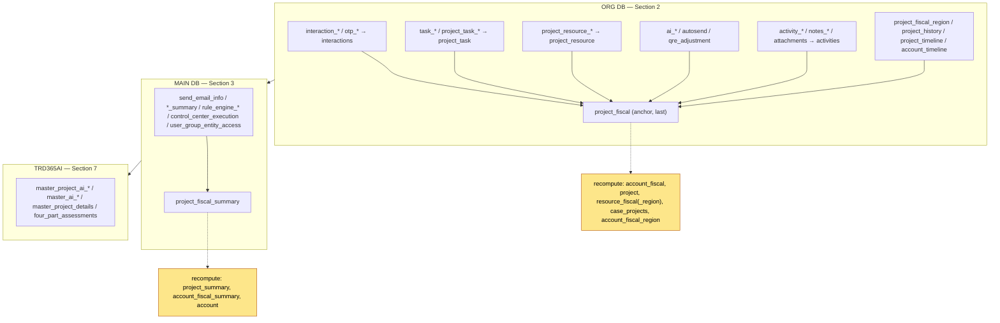

# Project fiscal-year deletion — table order reference

Tables touched when deleting one **project-fiscal**, in the exact order the
scripts execute. Deletes run **children → parents** so foreign keys are satisfied;
`project_fiscal` (the anchor row) is removed last in ORG. The list is identical
for every project — it is driven by the SQL, not the data.

Scope legend: **(fiscal)** = always deleted for this fiscal · **(project)** =
project-scoped rows deleted only when this is the *last* fiscal · a few optional
tables are **skipped when absent** in an account (no-op).

> These are all runs with `is_last_fiscal = FALSE`: parent-project rows are
> **kept** and their aggregates **recomputed** (see Updated section) rather than
> deleted. If a fiscal were the last one, the parent `project` and its
> project-level child rows would also be deleted.

---

## 🗑️ Tables DELETED (in execution order)

### ORG DB — `thinkrd365_org.<account_schema>` (Section 2)
| # | table | note |
|---|-------|------|
| 1 | interaction_attachments | |
| 2 | interaction_response_history | |
| 3 | interaction_items | |
| 4 | interaction_timeline | |
| 5 | interaction_history | |
| 6 | interaction_status_history | |
| 7 | otp_entries_history | |
| 8 | otp_entries | |
| 9 | interactions | |
| 10 | four_part_assessment | |
| 11 | project_task_timeline | |
| 12 | project_task_history | |
| 13 | task_tags | |
| 14 | task_comments | |
| 15 | task_collaborators | |
| 16 | task_attachments | |
| 17 | task_history | |
| 18 | project_task | |
| 19 | project_resource_fiscal_region | |
| 20 | project_resource_fiscal | |
| 21 | project_resource_timeline | |
| 22 | project_resource_history | |
| 23 | project_resource | |
| 24 | ai_technical_summary | |
| 25 | ai_assessment_audit | |
| 26 | ai_assessment_error | |
| 27 | ai_assessment_qre | |
| 28 | autosend_interaction_audit | |
| 29 | project_qre_adjustment_history | skipped if absent |
| 30 | activity_attachments | (project) |
| 31 | activity_history | (project) |
| — | meeting_summary | (project) — skipped if absent |
| 32 | activities | (project) |
| 33 | notes_timeline | (project) |
| 34 | notes | (project) |
| 35 | attachments | (project_fiscal) |
| 36 | project_fiscal_region | |
| 37 | project_history | (fiscal) |
| 38 | project_timeline | (fiscal) |
| — | project_timeline_old | (fiscal) — skipped if absent |
| 39 | account_timeline | (fiscal) |
| — | project_fiscal_history | skipped if absent |
| 40 | **project_fiscal** | anchor row — removed last |

### MAIN DB — `thinkrd365_main.trd365` (Section 3)
| # | table | scope |
|---|-------|-------|
| 41 | send_email_info | fiscal |
| 42 | ai_trigger_records | fiscal |
| 43 | interactions_summary | fiscal |
| 44 | rule_engine_records | fiscal |
| 45 | rule_engine_notification_records | fiscal |
| 46 | control_center_execution | fiscal |
| 47 | user_group_entity_access | fiscal |
| 48 | project_fiscal_summary | fiscal |
| 49 | attachment_summary | fiscal |
| 50 | notes_summary | fiscal |
| 51 | meeting_summary | fiscal |
| 52 | task_summary | fiscal |

### TRD365AI — `public` (Section 7)
| # | table (matched by `projectId` / `"projectId"`) |
|---|-------|
| 53 | master_project_ai_summary_logs |
| 54 | master_project_ai_summary_sections |
| 55 | master_project_ai_summary |
| 56 | master_project_ai_interaction |
| 57 | master_project_ai_assessment |
| 58 | master_ai_request |
| 59 | master_ai_llm_logs |
| 60 | master_ai_knowledge_base |
| 61 | master_project_details |
| 62 | four_part_assessments |

---

## ✏️ Tables UPDATED (recomputed) — surviving rows, not deleted

Aggregate/rollup rows that stay but are recalculated to exclude the removed
fiscal. Row counts scale with how many resources/regions/cases the fiscal touched.

### ORG DB (Section 2)
| # | table | recomputed | cardinality |
|---|-------|-----------|-------------|
| 1 | account_fiscal | project_resource rollup columns | 1 |
| 2 | account_fiscal_region | region rollups | per affected region |
| 3 | project | rollup columns | 1 |
| 4 | case_projects | type-agnostic totals | per linked case |
| 5 | resource_fiscal | resource totals | per affected resource |
| 6 | resource_fiscal_region | resource-region totals | per affected resource |

### MAIN DB (Section 3)
| # | table | recomputed |
|---|-------|-----------|
| 7 | project_summary | total_cost / total_effort |
| 8 | account_fiscal_summary | fiscal-year aggregates |
| 9 | account | total_projects / total_project_cost |

> **TRD365AI: no updates** — AI tables are delete-only.

---

## Section → database map

| Section | DB | role |
|---------|-----|------|
| 1 | ORG | pre-backup snapshot (counts) |
| 2 | ORG | **delete** + recompute |
| 3 | MAIN | pre-snapshot + **delete** + recompute |
| 4 | ORG | post-delete diff (verify) |
| 5 | MAIN | post-delete diff (verify) |
| 6 | TRD365AI | pre-backup snapshot |
| 7 | TRD365AI | **delete** |
| 8 | TRD365AI | post-delete diff (verify) |

## Dependency flow (delete direction: children → parents)

---
*Generated from run reports on 2026-07-23. Source of truth is the `base_sql/`
scripts; regenerate counts per project with `python impact_report.py <report.json>`.*
